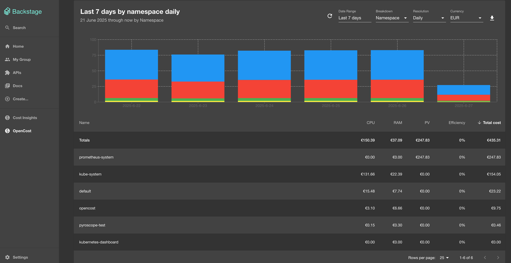

# What is OpenCost?

OpenCost is a FinOps cost monitoring tool for Kubernetes environments.  
It provides real-time visibility into resource usage and associated costs, helping teams optimize cloud spend and improve efficiency.

- **Open Source**: Free and community-driven (CNCF)
- **Kubernetes Native**: Designed for cloud-native workloads
- **Actionable Insights**: Detailed cost allocation and reporting
- **Alternatives**: Kubecost (Commercial)

---

# Integrations

- **Cloud Providers**: AWS, GCP, Azure, and others for cloud cost allocation.
- **On-Premises**: Default and custom pricing for on-prem.
- **Miscellaneous**: Prometheus, Grafana, kubectl cost, Backstage.

For more details, see the [OpenCost Integrations documentation](https://opencost.io/docs/integrations/).

---

# Installation

## Prerequisites

- A Kubernetes cluster with `kube-state-metrics` enabled
- [Prometheus](https://opencost.io/docs/installation/prometheus/)

## Install OpenCost

```sh
helm repo add opencost https://opencost.github.io/opencost-helm-chart
helm repo update
helm install opencost opencost/opencost --namespace opencost --create-namespace -f values.yaml
```

Refer [default `values.yaml`](https://github.com/opencost/opencost-helm-chart/blob/main/charts/opencost/values.yaml) for possible configuration options.

---

## Verify Installation

```sh
kubectl port-forward --namespace opencost svc/opencost 9003:9003
kubectl port-forward --namespace opencost svc/opencost 9090:9090
```

Then open:
- [http://localhost:9090](http://localhost:9090) for the UI
- [http://localhost:9003/metrics](http://localhost:9003/metrics) for Prometheus Exporter

---

## Using `kubectl cost`

The [`kubectl-cost`](https://opencost.io/docs/integrations/kubectl-cost) plugin allows you to view Kubernetes cost information directly from the command line.

### Usage

```sh
kubectl cost --service-port 9003 --service-name opencost --kubecost-namespace opencost --allocation-path /allocation/compute  \
    namespace \
    --historical \
    --window 5d \
    --show-cpu \
    --show-memory \
    --show-pv \
    --show-efficiency=false
```

```sh
kubectl cost --service-port 9003 --service-name opencost --kubecost-namespace opencost --allocation-path /allocation/compute  \
    namespace \
    --window 2h \
    --show-efficiency=true
```

---

## Prometheus + Grafana Dashboard


Refer [OpenCost Prometheus docs](https://opencost.io/docs/integrations/opencost-exporter#dashboard-examples) for more details.

---

## Backstage



Refer [Backstage OpenCost plugin](https://github.com/backstage/community-plugins/blob/main/workspaces/opencost/plugins/opencost/README.md) for more details.

---

## References

- [OpenCost Documentation](https://www.opencost.io/docs/)
- [Helm Chart Repo](https://github.com/opencost/opencost-helm-chart)

